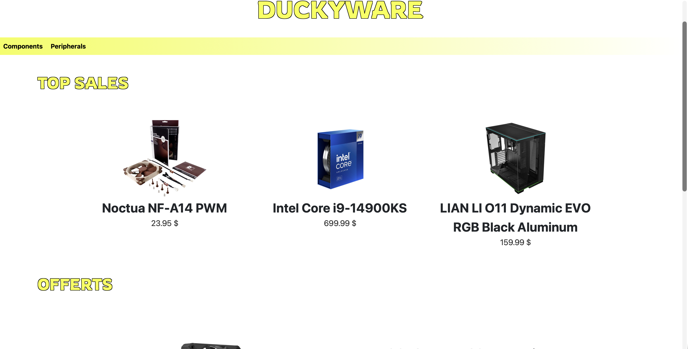
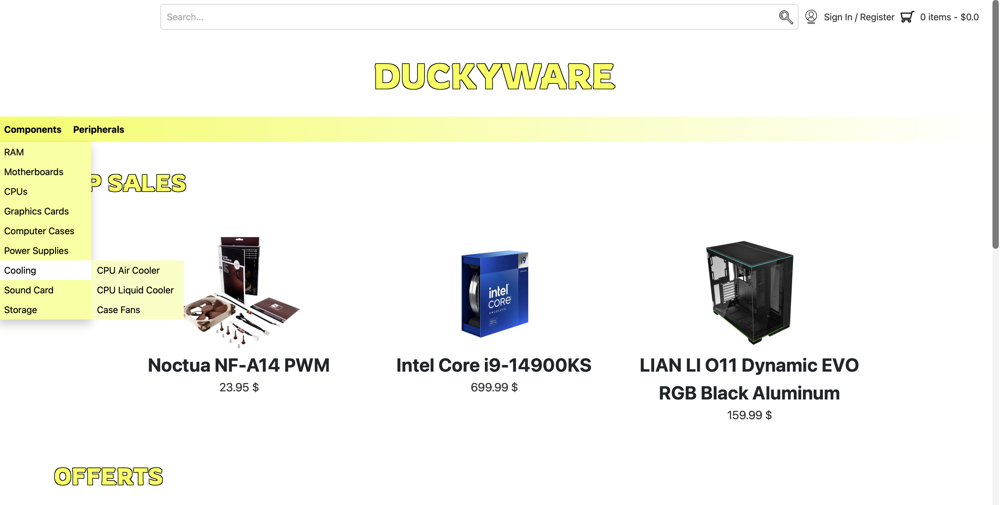
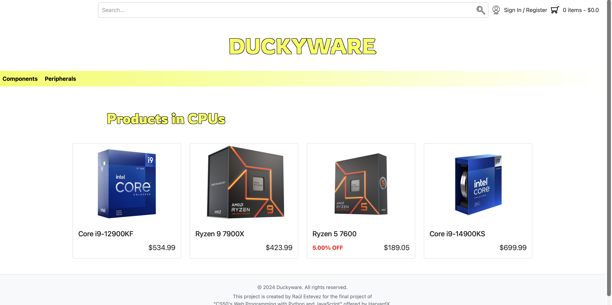
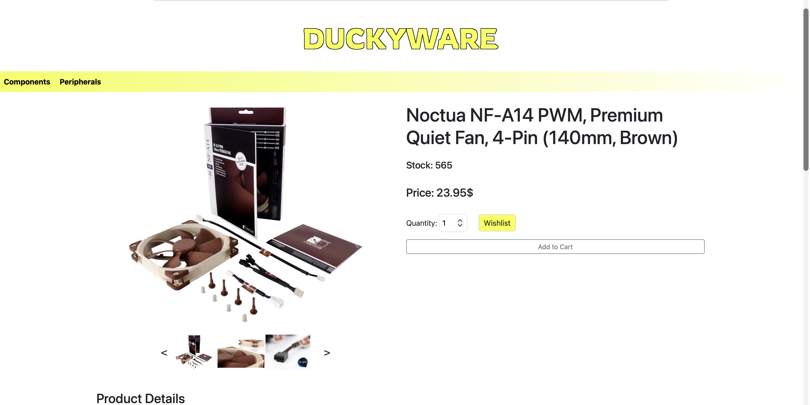
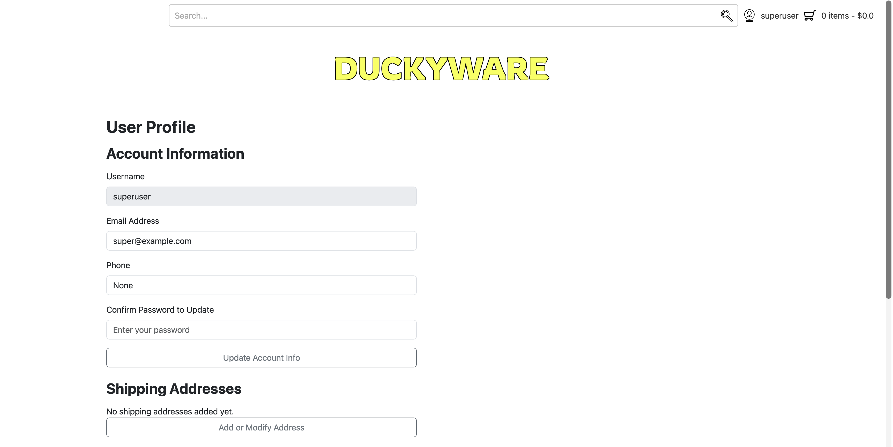
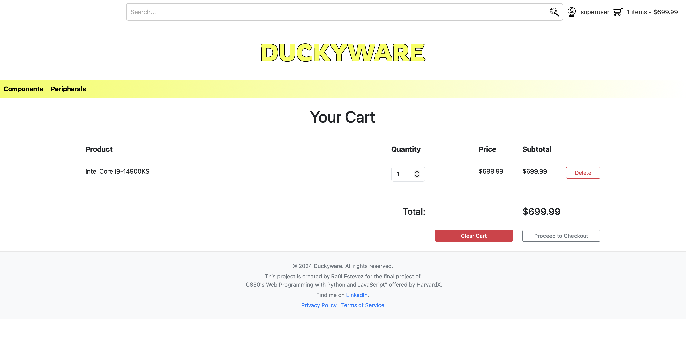
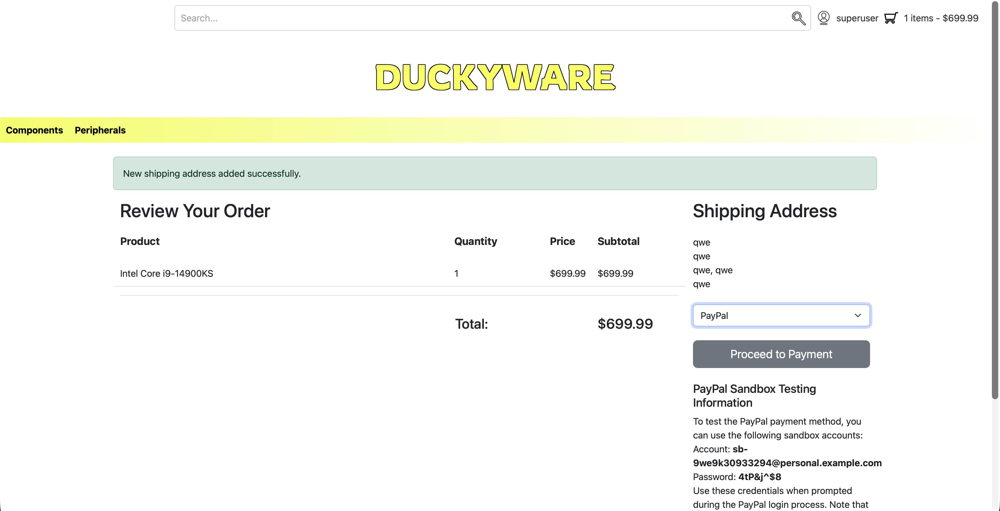
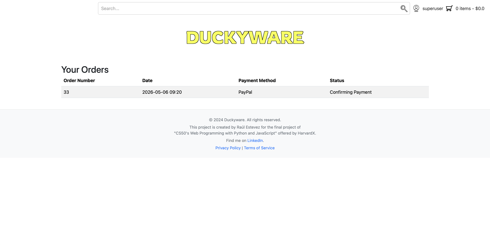
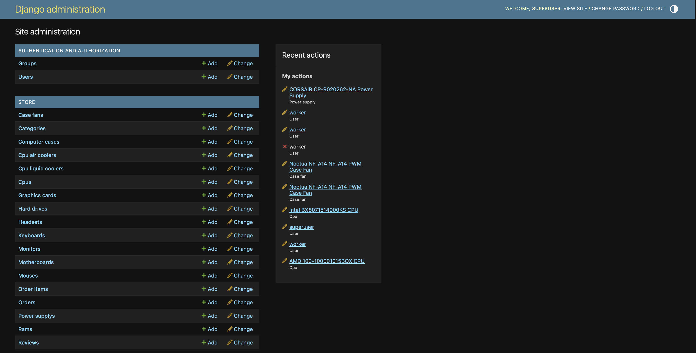

# CAPSTONE - DuckyWare

**Spanish version:** [README_es.md](README_es.md)

## Final Project of the CS50W Course

**Author:** Raul Estevez  
**GitHub:** [RaulEstevezA](https://github.com/RaulEstevezA)  
**LinkedIn:** [Raul Estevez](https://www.linkedin.com/in/raul-estevez-abella-9a2a1687/)  
**Contact:** [r.estevezbella@gmail.com](mailto:r.estevezbella@gmail.com)  
**Demo video:** [YouTube](https://youtu.be/ckqKTbNd3lc)

## Overview

DuckyWare is a Django-based e-commerce web application focused on computer hardware and peripherals. The project was built as the final capstone for CS50W, with the goal of creating a more realistic online store than the course's earlier auction-style commerce project.

The application includes a dynamic storefront, product categories, product detail pages, user registration and authentication, profile management, shipping addresses, wishlist functionality, shopping cart behavior for both anonymous and logged-in users, checkout, order history, and several payment flows including PayPal sandbox integration.

The name and visual identity are inspired by the rubber duck often seen in CS50 material. That is why the interface uses a yellow-centered visual theme and the name DuckyWare, a mix of "duck" and "hardware."

## Screenshots

<h3 align="center">Home Page</h3>

<p align="center">
  
</p>

<h3 align="center">Category Menu</h3>

<p align="center">
  
</p>

<h3 align="center">Product Listing</h3>

<p align="center">
  
</p>

<h3 align="center">Product Detail</h3>

<p align="center">
  
</p>

<h3 align="center">Profile Panel</h3>

<p align="center">
  
</p>

<h3 align="center">Payment Flow</h3>

<p align="center">
  
</p>

<h3 align="center">PayPal Sandbox</h3>

<p align="center">
  
</p>

<h3 align="center">Orders</h3>

<p align="center">
  
</p>

<h3 align="center">Admin Panel</h3>

<p align="center">
  
</p>

## Distinctiveness and Complexity

DuckyWare is designed as a full online store with product inventory, shopping cart behavior, order creation, profile and shipping data, detailed product specifications, discounts, and multiple checkout flows.

The project uses a modular architecture where product categories are represented by different Django models. This allows each type of hardware product to store its own technical specifications while still sharing common store behavior such as images, reviews, cart items, wishlists, and orders. The navigation bar is also dynamic: categories and subcategories are loaded from the database, and the menu supports up to 6 nested child levels. If new categories or subcategories are created, they are automatically added to the navbar without hardcoding new menu links.

## Main Features

- **Dynamic home page:** shows discounted products, best-selling products, and products with the lowest stock.
- **Dynamic category and subcategory system:** products are organized through database-driven categories, and the navbar automatically reflects category changes with support for up to 6 nested child levels.
- **Multiple product models:** supports CPUs, computer cases, power supplies, case fans, motherboards, graphics cards, RAM, storage, monitors, keyboards, headsets, mice, webcams, and cooling products.
- **Detailed product pages:** each product can show multiple images and category-specific technical fields.
- **Search:** users can search products by title and view matching results with images and prices.
- **Wishlist:** authenticated users can add or remove products from their wishlist.
- **Shopping cart:** supports anonymous session carts and authenticated user carts.
- **Cart merge on login/register:** items added before authentication are merged into the user's cart after login or registration.
- **Discount and stock logic:** discounted units, stock limits, price calculation, and units sold are handled in the backend.
- **Checkout:** users can review cart items and select a payment method.
- **Payment methods:** includes PayPal sandbox flow, credit card simulation, and bank transfer flow.
- **Orders:** completed payments create orders and order items with price-at-purchase values.
- **Profile management:** users can update email, phone, password, and shipping address data.
- **Admin management:** Django admin is configured to manage products, product images, categories, users, orders, reviews, and related store data.
- **Responsive interface:** Bootstrap, CSS, and JavaScript are used to provide a cleaner responsive shopping experience.

## Data Included

The repository includes a SQLite database (`db.sqlite3`) with sample data. At the time of review, the database contains users, product categories, product images, orders, wishlists, shipping addresses, and sample products.

Current sample product counts include CPUs, computer cases, a power supply, and case fans. Product images are stored in the `media/` directory, while project screenshots are stored in `img/`.

## Technologies Used

- Python
- Django
- SQLite
- JavaScript
- Bootstrap
- HTML
- CSS
- Pillow
- paypalrestsdk

## Project Structure

```text
.
├── duckyware/
│   ├── settings.py
│   ├── urls.py
│   ├── asgi.py
│   └── wsgi.py
├── store/
│   ├── models/
│   │   ├── base_models.py
│   │   └── product_models.py
│   ├── templates/store/
│   ├── static/store/
│   ├── templatetags/
│   ├── admin.py
│   ├── forms.py
│   ├── product_types.py
│   ├── urls.py
│   └── views.py
├── media/
├── img/
├── db.sqlite3
├── manage.py
├── requirements.txt
└── README.md
```

## Important Files

- `store/models/base_models.py`: shared store models such as categories, profiles, shipping addresses, cart items, orders, product images, and reviews.
- `store/models/product_models.py`: concrete product models with hardware-specific fields.
- `store/product_types.py`: maps category names to the correct product model.
- `store/views.py`: contains the main storefront, authentication, cart, checkout, payment, wishlist, profile, and order logic.
- `store/urls.py`: defines all application routes.
- `store/admin.py`: registers product and store models in Django admin.
- `store/static/store/js/`: contains JavaScript for cart, checkout, product detail, profile, and layout behavior.
- `store/static/store/css/`: contains page-specific and general styles.

## Application Routes

Some of the main routes are:

- `/`: home page
- `/register/`: user registration
- `/login/`: user login
- `/logout`: user logout
- `/profile/`: account and profile panel
- `/orders/`: order history
- `/orders/<order_id>/`: order detail
- `/wishlist/`: wishlist page
- `/cart/`: shopping cart
- `/checkout/`: checkout page
- `/search/`: product search
- `/category/<category_name>/`: category listing
- `/category/<category_name>/product/<product_id>/`: product detail page
- `/payment/`: PayPal payment flow
- `/credit_card/`: credit card payment simulation
- `/transfer/`: bank transfer payment flow
- `/admin/`: Django admin panel

## How to Run Locally

Create and activate a virtual environment:

```sh
python3 -m venv .venv
source .venv/bin/activate
```

Install the required packages:

```sh
pip install Django Pillow paypalrestsdk
```

Apply migrations if needed:

```sh
python manage.py migrate
```

Run the development server:

```sh
python manage.py runserver
```

Open the project in the browser:

```text
http://127.0.0.1:8000/
```

If the autoreloader causes issues in your environment, run:

```sh
python manage.py runserver 127.0.0.1:8000 --noreload
```

## Admin Access

The project includes sample users in the SQLite database. If you do not know an existing admin password, create a new admin user with:

```sh
python manage.py createsuperuser
```

Then open:

```text
http://127.0.0.1:8000/admin/
```

## PayPal Sandbox

The project includes PayPal sandbox payment integration through `paypalrestsdk`. PayPal credentials and sandbox mode are configured in `duckyware/settings.py`.

The README previously included this example sandbox buyer account:

```text
Account: sb-9we9k30933294@personal.example.com
Password: 4tP&j^$8
```

## Notes

- This project is configured for local development with `DEBUG = True`.
- The included SQLite database is useful for demonstration and testing.
- Product images used by the application are located in `media/`.
- Screenshots used in this README are located in `img/`.
- For production deployment, the Django secret key, PayPal credentials, `DEBUG`, `ALLOWED_HOSTS`, static files, media handling, and database configuration should be moved to a safer production setup.
